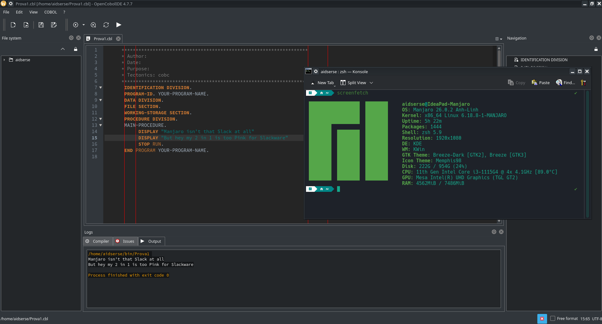
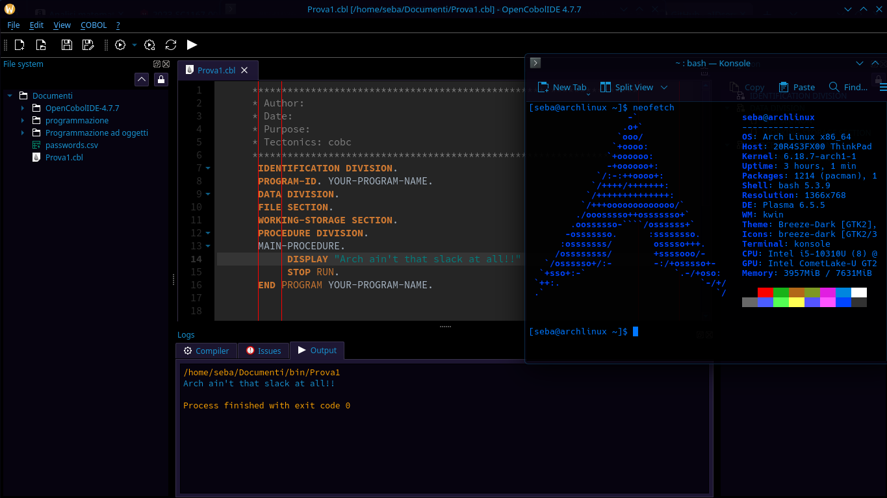

OpenCobolIDE-4.7.7
------------------

OpenCobolIDE is no longer maintained, see https://github.com/OpenCobolIDE/OpenCobolIDE/issues/439

This repository is a practical fork created to keep OpenCobolIDE usable *today* on modern Linux systems.
The goal is simple and finite: have a COBOL IDE that can open a file, compile, run, and show output *without* having to fall back to the terminal every time.
No long-term roadmap, no promise of upstream parity: it exists because I needed it working, and now it does.

The name Opencobolide-4.7.7 is intentionally “one step after” the last upstream release (4.7.6): not because there is a new upstream version,
but because this fork bundles a set of compatibility fixes that make the original codebase run correctly again (even tho it's based of 4.7.4 because thats what I found in SlackBuilds lol).

What changed in this fork
-------------------------

This fork applies a small set of targeted fixes, mostly focused on:

1) Python compatibility (modern versions)

   - Removed reliance on deprecated/removed APIs (e.g. old distro detection via ``platform.linux_distribution()``). The objective is not to replace it with another fragile detection mechanism, but to avoid crashing at import time.

   - Updated bundled libraries for modern Python:
     - ``collections.Callable / Iterable / Mapping / MutableMapping / Sequence / Iterator`` moved to ``collections.abc`` where needed.
     - fixed old regex patterns that rely on inline flags at the end of the expression (newer Python rejects them).
     - removed/avoided old universal-newline file mode ``'Ur'`` (not valid on modern Python).

2) Qt strictness / float-vs-int issues (PyQt5 on newer distros)
   - Newer Qt/PyQt builds are stricter about argument types: many APIs require **int** and will crash/throw if given **float**.
   - Fixed several panels/modes where values like marker height or font metrics became floats and were passed to Qt methods:
     - ``QSize(...)``, ``QRect.setX/setY/setBottom(...)``, ``QPainter.drawLine(...)``, etc.
   - This prevents paint-event exceptions that could cascade into recursive repaints and even segfaults.

3) Qt signal/slot correctness (the “triggered(bool)” problem)
   - Qt actions connected to slots that did not match the expected signature caused warnings like::

       QObject::connect: Cannot connect QAction::triggered(bool) to (nullptr)::to_lower()

     In practice this meant a key assumption (“the editor/action target is always valid at that moment”) was not holding.
     When the action wiring failed, the editor could not reliably operate on the current document state, leading to repeated failures and odd behaviour
     (including situations where UI actions effectively became unusable).
     The fix makes the slots and action creation robust and compatible with the Qt signal signature.

4) Backend / extlibs import reliability
   - OpenCobolIDE bundles a lot of pure-python dependencies in ``open_cobol_ide/extlibs``.
     This is useful, but it also means the import path must be deterministic for both the main process and the backend process.
   - The backend startup script is adjusted so it can always find the bundled libraries without depending on “whatever happens to be first on ``sys.path``”.
   - With total honesty, here I used chatgpt because I had no clue of what I was doing (If i want to run OpenCobolIDE I suppose you understand I am not exacly a Python guy...)

5) Eliminating stdlib shadowing
   - The bundled extlibs contained a module that could shadow Python’s standard library ``enum`` module.
     When that happened, Python would lose ``enum.IntFlag``, and even importing ``re`` could explode.
     The fix removes that shadowing, restoring correct stdlib behaviour.

6) Compile button / state handling
   - The compile action is guarded: if no file is open, it shows a warning instead of crashing or entering an inconsistent state.
   - Additionally, a logic path could lead to the compile button being disabled “by itself” depending on state transitions.
     This was corrected so the UI reliably allows compiling both executables and modules once the prerequisites are met.

This fork is Slackware-centered (but not only)
--------------------------------------------

This work started on Slackware 15.0 (Python 3.9).
It should be broadly portable, but this fork does not claim universal compatibility.
Slackware’s conservative base and straightforward packaging model make this kind of “keep it working” effort excepitionally practical.

.. image:: doc/Images/slackoff.jpg
    :align: center

Arch-based status
-----------------

On Manjaro / Arch-based systems this fork **works** (open/edit/compile/run/output). It hasn't been tested on Artix but I mean...

Known issues (mostly Arch-based)
--------------------------------

Everything essential works, but there are still a couple of editor/UI quirks:

1) Qt controls can be a bit clunky
   - For example switching between open files may work reliably only via ``CTRL+TAB``. It's still usable, just not perfect.

2) Tab/document confusion on some Arch-based setups (not seen on Slackware)
   - Sometimes, after opening multiple files, the editor content can appear swapped/overlapped:
     e.g. file1 content appears under file2, or file2 replaces file1, etc.
   - For now, the practical recommendation is:
     - use one file at a time, **or**
     - work with separate OpenCobolIDE instances (one file per instance).

If you run it on another distribution and it fails, it will most likely be due to:

- newer Python versions removing additional old APIs used by bundled dependencies,
- different Qt/PyQt packaging and import layouts,
- stricter packaging defaults.

In that case, fixes should still be possible, but they may require additional small patches.

Dependencies
------------

On Arch/Manjaro I installed (package names):

- python
- python-setuptools
- python-pyqt5
- qt5-base
- gnucobol
- gcc
- make

(Other distros will have equivalent packages with different names.)

License
-------

OpenCobolIDE is released under the GPL version 3 (and i obviously follow that).

Installation
------------

Slackware
#########

This fork is intended to be built/installed in a Slackware-friendly way (SlackBuild style).
If you are using the SlackBuilds tree, the original packaging approach still applies:
extract source, run the build script, then install the resulting package.

The key difference is that this fork already includes the fixed sources, so you should not need post-install editing.

Other distributions
###################

If your system provides Python3, PyQt5, and GnuCOBOL, you can generally install from source.
Because upstream is old and modern build tooling increasingly assumes wheels/PEP517,
a plain ``sudo python3 setup.py install`` install may be the simplest approach on some systems.

Arch / Manjaro note (GnuCOBOL config)
#####################################

On some Arch-based setups, gnucobol compiler with ``-std=0`` may fail with::

    /usr/share/gnucobol/config/0.conf: No such file or directory

A simple workaround is to symlink ``0.conf`` to ``default.conf``::

    sudo ln -sf /usr/share/gnucobol/config/default.conf /usr/share/gnucobol/config/0.conf

Screenshot
----------

.. image:: doc/Images/ScreenshotSlack.png
    :align: center

Get slack!!!
-----------
.. image:: doc/Images/dobbs.jpg
    :align: center
